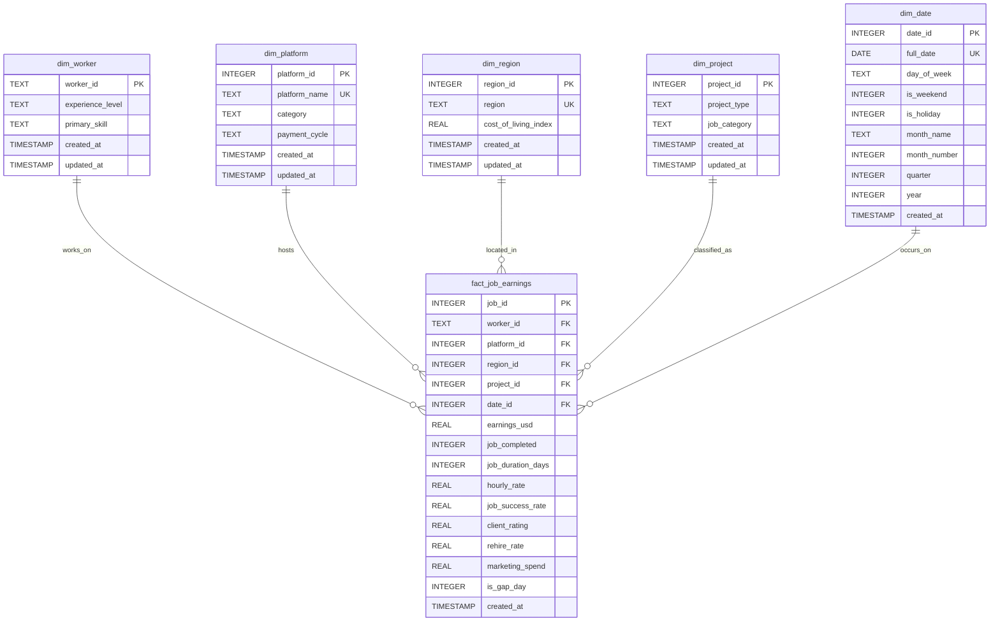

# Database Implementation

This directory contains the SQLite database implementation for The Flexi Income Intelligence Suite, including schema definitions, data loading scripts, and database documentation.

## Contents

- **schema.sql** - Complete DDL script with table definitions, constraints, and indexes
- **load_data.py** - Python script to load CSV data into SQLite database
- **freelance_earnings.db** - SQLite database file (generated after running load_data.py)

## Database Schema

### Entity-Relationship Diagram



### Star Schema Architecture

```
                    ┌─────────────────┐
                    │   dim_worker    │
                    │  (worker_id)    │
                    └────────┬────────┘
                             │
                             │
    ┌─────────────────┐      │      ┌─────────────────┐
    │  dim_platform   │      │      │   dim_region    │
    │ (platform_id)   │      │      │  (region_id)    │
    └────────┬────────┘      │      └────────┬────────┘
             │               │               │
             └───────────────┼───────────────┘
                             │
                    ┌────────▼────────┐
                    │                 │
                    │ FACT_JOB_       │
                    │   EARNINGS      │
                    │                 │
                    └────────┬────────┘
             ┌───────────────┼───────────────┐
             │               │               │
    ┌────────▼────────┐      │      ┌────────▼────────┐
    │  dim_project    │      │      │    dim_date     │
    │  (project_id)   │      │      │   (date_id)     │
    └─────────────────┘      │      └─────────────────┘
                             │
```

## Setup Instructions

### 1. Prerequisites

Ensure you have run the ETL pipeline first:

```bash
# Run ETL pipeline to generate cleaned CSV files
jupyter notebook etl/etl_pipeline.ipynb
# Execute all cells
```

### 2. Create and Load Database

```bash
# Load data from CSV files into SQLite
python database/load_data.py
```

This will:

1. Create the database file: `database/freelance_earnings.db`
2. Execute `schema.sql` to create tables, indexes, and views
3. Load all dimension tables
4. Load the fact table
5. Verify data integrity
6. Optimize the database with ANALYZE

### 3. Verify Database

```bash
# Connect to database
sqlite3 database/freelance_earnings.db

# Check tables
.tables

# Check record counts
SELECT 'dim_worker' AS table_name, COUNT(*) AS record_count FROM dim_worker
UNION ALL
SELECT 'dim_platform', COUNT(*) FROM dim_platform
UNION ALL
SELECT 'dim_region', COUNT(*) FROM dim_region
UNION ALL
SELECT 'dim_project', COUNT(*) FROM dim_project
UNION ALL
SELECT 'dim_date', COUNT(*) FROM dim_date
UNION ALL
SELECT 'fact_job_earnings', COUNT(*) FROM fact_job_earnings;
```

## Database Features

### Constraints

✅ **Primary Keys**: All tables have defined primary keys
✅ **Foreign Keys**: Fact table enforces referential integrity to all dimensions
✅ **Unique Constraints**: Platform names, regions, and dates are unique
✅ **Check Constraints**:

- Ratings: 0-5 range
- Success rates: 0-100% range
- Binary flags: 0 or 1 only
- Non-negative earnings

### Indexes

**Dimension Tables:**

- Primary key indexes (automatic)
- Secondary indexes on commonly filtered columns (experience_level, platform_name, region, etc.)

**Fact Table:**

- Indexes on all foreign keys
- Indexes on commonly filtered metrics (earnings_usd, is_gap_day)
- Composite indexes for common join patterns:
  - (platform_id, date_id)
  - (region_id, date_id)
  - (worker_id, date_id)

### Pre-built Views

The schema includes several analytical views:

1. **vw_job_earnings_detailed** - Complete denormalized view joining all dimensions
2. **vw_platform_summary** - Aggregated metrics by platform
3. **vw_worker_performance** - Worker-level performance metrics
4. **vw_regional_analysis** - Regional earnings vs cost of living
5. **vw_monthly_trends** - Time-series earnings trends

## Usage Examples

### Python Connection

```python
import sqlite3
import pandas as pd

# Connect to database
conn = sqlite3.connect('database/freelance_earnings.db')

# Query using pandas
df = pd.read_sql_query("SELECT * FROM vw_platform_summary", conn)
print(df)

# Query using sqlite3
cursor = conn.cursor()
cursor.execute("SELECT platform_name, avg_earnings FROM vw_platform_summary ORDER BY avg_earnings DESC")
results = cursor.fetchall()

conn.close()
```

### SQL Queries

```sql
-- Top 10 earning workers
SELECT worker_id, experience_level, total_earnings, avg_hourly_rate
FROM vw_worker_performance
ORDER BY total_earnings DESC
LIMIT 10;

-- Platform comparison
SELECT platform_name, total_jobs, avg_earnings, avg_client_rating
FROM vw_platform_summary
ORDER BY avg_earnings DESC;

-- Monthly earnings trends
SELECT year, month_name, total_earnings, active_workers
FROM vw_monthly_trends
ORDER BY year, month_number;

-- Regional cost of living analysis
SELECT region, avg_earnings, cost_of_living_index, earnings_vs_col_ratio
FROM vw_regional_analysis
ORDER BY earnings_vs_col_ratio DESC;

-- Find high-performing workers in specific skill
SELECT * FROM vw_worker_performance
WHERE primary_skill = 'Web Development'
  AND avg_success_rate > 80
ORDER BY total_earnings DESC;
```

### Advanced Queries

```sql
-- Year-over-year growth by platform
SELECT
    p.platform_name,
    d.year,
    SUM(f.earnings_usd) AS total_earnings
FROM fact_job_earnings f
JOIN dim_platform p ON f.platform_id = p.platform_id
JOIN dim_date d ON f.date_id = d.date_id
GROUP BY p.platform_name, d.year
ORDER BY p.platform_name, d.year;

-- Worker retention analysis
SELECT
    w.experience_level,
    COUNT(DISTINCT w.worker_id) AS worker_count,
    AVG(f.rehire_rate) AS avg_rehire_rate,
    AVG(f.client_rating) AS avg_client_rating
FROM dim_worker w
JOIN fact_job_earnings f ON w.worker_id = f.worker_id
GROUP BY w.experience_level;

-- Weekend vs weekday earnings
SELECT
    d.is_weekend,
    CASE WHEN d.is_weekend = 1 THEN 'Weekend' ELSE 'Weekday' END AS day_type,
    COUNT(*) AS job_count,
    AVG(f.earnings_usd) AS avg_earnings,
    SUM(f.earnings_usd) AS total_earnings
FROM fact_job_earnings f
JOIN dim_date d ON f.date_id = d.date_id
GROUP BY d.is_weekend;
```

## Database Maintenance

### Backup Database

```bash
# Create backup
cp database/freelance_earnings.db database/freelance_earnings_backup_$(date +%Y%m%d).db

# Or use SQLite dump
sqlite3 database/freelance_earnings.db .dump > database/backup.sql
```

### Vacuum Database

```sql
-- Reclaim unused space and optimize
VACUUM;
```

### Re-index

```sql
-- Rebuild all indexes
REINDEX;

-- Update query planner statistics
ANALYZE;
```

## Performance Tips

1. **Always use indexes** - Query on indexed columns (foreign keys, dates)
2. **Use views** - Pre-built views are optimized for common queries
3. **Batch operations** - Use transactions for bulk inserts/updates
4. **Analyze regularly** - Run ANALYZE after major data changes

## Troubleshooting

### Foreign Key Errors

If you get foreign key constraint violations:

```sql
-- Check foreign key integrity
PRAGMA foreign_key_check;

-- Temporarily disable for debugging (not recommended for production)
PRAGMA foreign_keys = OFF;
```

### Performance Issues

```sql
-- Check query execution plan
EXPLAIN QUERY PLAN
SELECT * FROM vw_platform_summary;

-- Identify slow queries with timing
.timer ON
```

## Database Size

Typical database sizes:

- Empty schema: ~100 KB
- With sample data (15K+ records): ~5-10 MB
- Indexes add approximately 20-30% overhead

## Schema Version

- **Version**: 1.0
- **Created**: December 28, 2025
- **Database Engine**: SQLite 3.x
- **Compatibility**: SQLite 3.8.0+

## Future Enhancements

Potential additions for production use:

- **Slowly Changing Dimensions (SCD Type 2)** for historical tracking
- **Partitioning** for large fact tables (when migrating to PostgreSQL/MySQL)
- **Materialized views** for performance (PostgreSQL)
- **Row-level security** for multi-tenant deployments
- **Audit logging** for data changes
- **Data retention policies** and archival strategies
